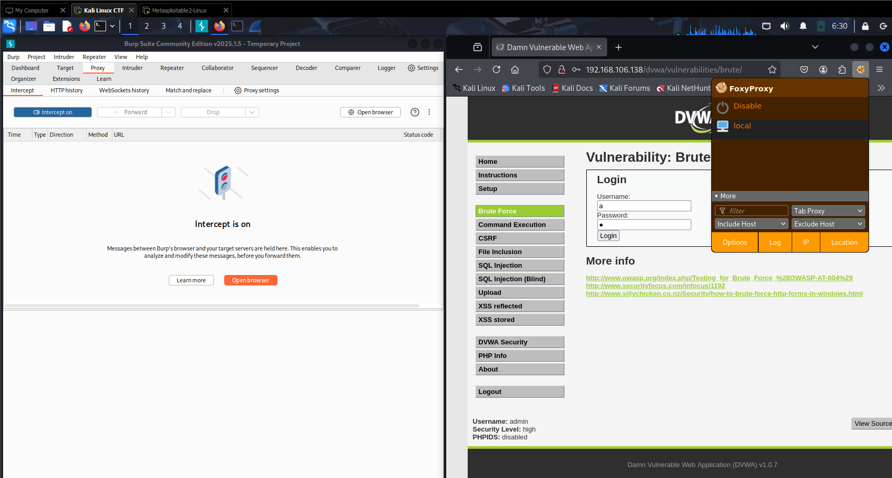
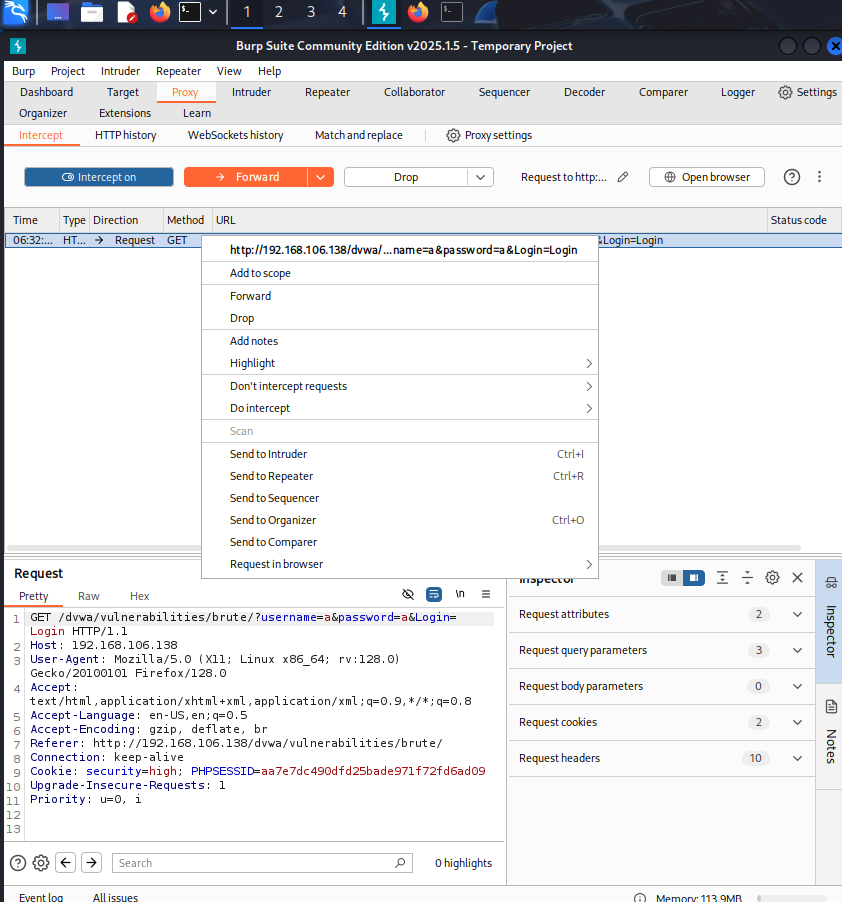
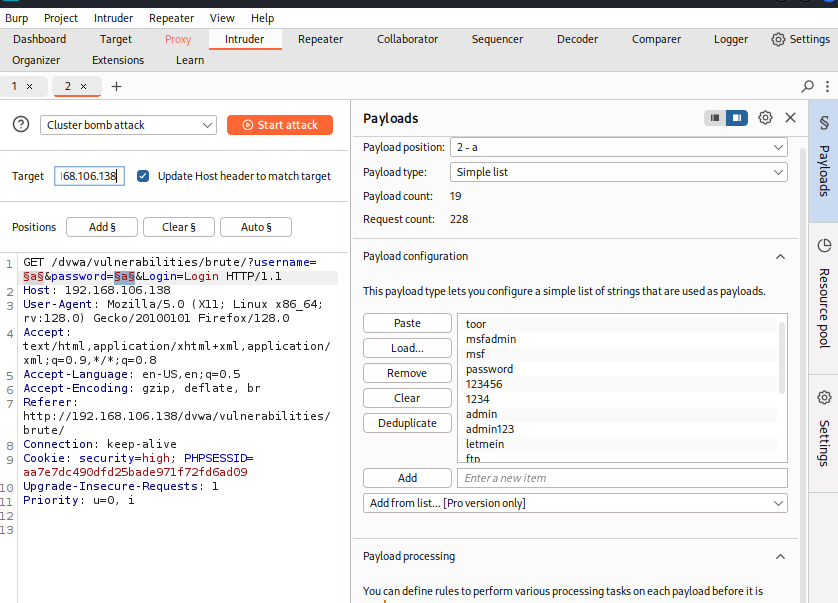

# 🛡️ Lab 1: Cryptographic Attacks - Brute Force and Traffic Analysis on Network Protocols

**Author**: Raja Muhammad Haiqal Shah  
**Date**: April 10, 2025  
**Course**: Network Security  
**Lab Duration**: 3 hours  
**Total Marks**: 15  

---

## 🔍 Objective

This lab demonstrates the exploitation of insecure network protocols through:

- Brute-force attacks using **Hydra** and **Burp Suite**
- Network traffic analysis using **Wireshark** and **tcpdump**
- Identifying secure vs insecure protocols
- Proposing mitigation strategies for observed vulnerabilities

---

## ⚙️ B. Lab Tasks

### 🔎 1. Enumerate the Vulnerable VM to Discover Usernames

**Tool used**: `enum4linux`, `nmap`, 
**Command examples**:

```bash
enum4linux -a <target-ip>
```


```bash
nmap -sV -p21,23,22,80 <target-ip>
```


**Discovered usernames**:
- root
- msfadmin
- admin
- user
- service
- telnetd
- ftp
- mysql
- postgres
- tomcat55
- www-data
  


---

### 🔓 2. Perform Brute Force Attacks
#### 2.1 FTP, TELNET, SSH  
**Tools used**: `Hydra`

**FTP**
```bash
hydra -L users.txt -P simplepass.txt -t 4 ftp:ftp://<target-ip> 
```


**TELNET**
```bash
hydra -L users.txt -P simplepass.txt telnet://<target-ip>
```


**SSH**
```bash
hydra -l users.txt -P simplepass.txt ssh://<target-ip>
```


---

#### 🌐 HTTP (Web Login Brute Force)
**Tool Used**: Burp Suite (Intruder)

Steps:
1. Captured a POST request with credentials using Burp Suite Intercept.
2. Sent it to Intruder.
3. Set payload positions for username and password.
4. Imported wordlists (`simplepass.txt`).



setup out foxy proxy in extension and then intercept it in our burpsuite when we type in the username and pass in the website.



sent the GET request URL into our intruder for bruteforce attack.



simply select username field input 'a' and also the password field 'a' and import our simplepass.txt and user.txt,but to cut time we can also enter our own list in the field and then press 'add' to add in the list field.

---

### 🧪 3. Sniff Network Traffic
**Tool used**: `Wireshark` / `tcpdump`  
**Steps**:
1. Log in to FTP, Telnet, SSH, and HTTP using recovered credentials.


```bash
tcpdump -i eth0 -w capture.pcap
```


right click on ftp protocol and follow tcp stream
ftp sniff output in plaintext


telnet sniff output in plaintext too


ssh result is encrpyted!

**🧩 Analysis**:
 Protocol | Observation                 |
|----------|-----------------------------|
| FTP      | Credentials in plaintext ✅ |
| TELNET   | Data in plaintext ✅         |
| SSH      | Encrypted ✅                 |
| HTTP     | POST credentials visible ✅  |
---

### ⚠️ 4. Problems Encountered & Fixes

| Protocol | Problem                          | Fix                                     |
|----------|----------------------------------|-----------------------------------------|
| FTP      | Login delay after failures       | Used `-t 4` to reduce thread count      |
| TELNET   | Session timeout                  | Added timeout with `-T 10`              |
| HTTP     | Rate limiting after 10 attempts  | Added delay in Burp Intruder payloads   |
| SSH      | Account lockout after 5 attempts | Used slower brute-force speed in Hydra (`-t 1`) to avoid lockout |

---

### 🔐 5. Mitigation Strategies

| Protocol | Issue                        | Recommendation                                |
|----------|------------------------------|-----------------------------------------------|
| FTP      | Plaintext credentials        | Use **SFTP** (SSH File Transfer Protocol)     |
| TELNET   | No encryption                | Replace with **SSH**                          |
| SSH      | Vulnerable to brute force    | Implement **key-based auth** and **fail2ban** |
| HTTP     | Passwords sent via POST      | Use **HTTPS**, Captcha, and account lockouts  |

---

### 📝 6. Summary

**Tools Used**:
- Hydra  
- Burp Suite  
- Wireshark  
- nmap  
- tcpdump

**Tools Used**:  
Hydra,Burp Suite, Wireshark,  nmap, tcpdump

**Key Commands**:

```bash
hydra -l user.txt -P simplepass.txt ftp://<ip>
```
```bash
hydra -l user.txt -P simplepass.txt telnet://<ip>
```
```bash
hydra -l user.txt -P simplepass.txt ssh://<ip>
```
```bash
tcpdump -i eth0 -w capture.pcap
```

**Skills Practiced**:
- Brute force on multiple protocols  
- Packet sniffing and protocol analysis  
- Security assessment and hardening suggestions

### ✅ Conclusion

This lab highlights the importance of secure protocols and the dangers of using outdated services like FTP and Telnet. By simulating real-world brute force and traffic sniffing attacks, we gain deeper insights into protocol-level vulnerabilities and the necessity of mitigation techniques in modern networks.
