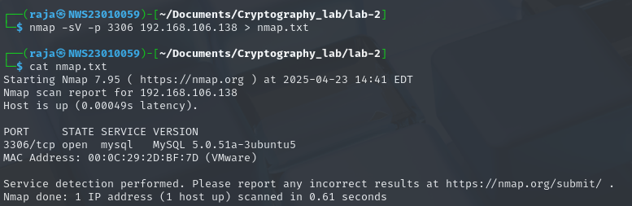
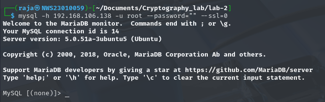
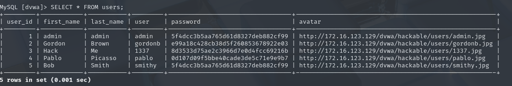
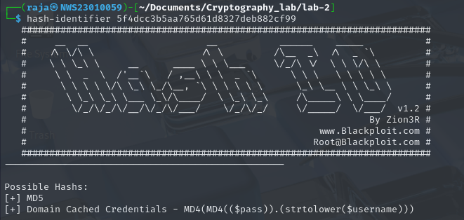
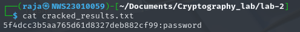
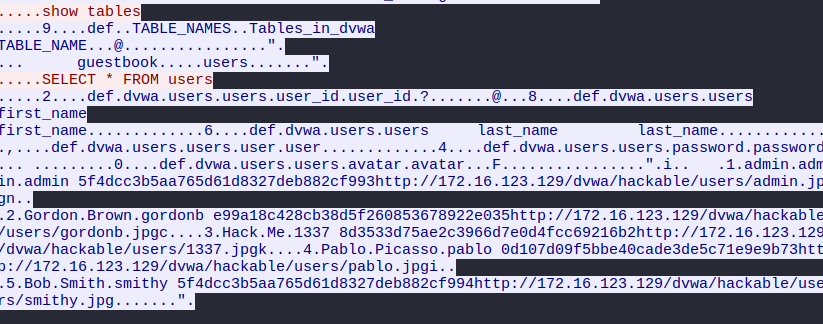

# 🔐 Lab 2: Cryptographic Attacks – Cracking Weak Password Hashes & Exploiting Poor Authentication in Databases

**👨‍💻 Author**: Raja Muhammad Haiqal Shah Bin Raja Muzairil Shah  
**📅 Date**: 25 April 2025  
**⏳ Time Allocation**: 3 Hours  
**📝 Total Marks**: 15  
**🧩 Lab Type**: Hands-On + Report + Demo/Debrief  

---

## 🧠 A. Lab Objectives

1. Identify and exploit cryptographic weaknesses in database authentication and password storage.
2. Perform offline hash cracking after discovering password hashes in a vulnerable database.
3. Investigate real-world cryptographic failures and propose secure solutions.
4. Document findings clearly in GitHub (Markdown) and present a short demo/debrief.

---

## 🛠️ Tools Used

- `Kali Linux` (OS)
- `nmap` (Service enumeration)  
- `mysql-client` (Database access)  
- `hashid` / `hash-identifier` (Hash detection)  
- `hashcat` / `john` (Hash cracking)  
- `wireshark` (Traffic analysis – optional)

---

## 🌐 IP Addresses

- **Attacker**: 192.168.106.130  
- **Victim**: 192.168.106.138  

---

## 🧩 B. Lab Tasks

### 1. 🔍 Service Enumeration and Initial Access

**Command Used:**

```bash
nmap -sV -p 3306 192.168.106.138 > nmap.txt
```

- Identified that **MySQL** was running on port **3306**.
- Confirmed open port and service details were written to `nmap.txt`.



**Connection Attempt:**

```bash
mysql -h 192.168.106.138 -u root --password=""
```

**Error Encountered:**
```
ERROR 2026 (HY000): TLS/SSL error: wrong version number
```

**Fix:**

```bash
mysql -h 192.168.106.138 -u root --password="" --ssl=0
```



✅ **Resolved**: TLS version mismatch between client and server.

> **Root Cause**:  
> MySQL < 5.7.11 does not support `--ssl-mode`. Use `--ssl=0` instead to disable SSL handshake.

---

### 2. 🧑‍💻 Enumeration of Users and Authentication Weaknesses

```sql
USE dvwa;
SHOW TABLES;
+----------------+
| Tables_in_dvwa |
+----------------+
| guestbook      |
| users          |
+----------------+

SELECT * FROM users;
```

- Found the `users` table containing usernames and **MD5 password hashes**.
- Chose user `admin` for further cracking.



**Saved hash to file:**

```bash
echo "5f4dcc3b5aa765d61d8327deb882cf99" > hash.txt
```

> ⚠️ **Reflection Question**:  
> Is accessing a database with no password a cryptographic failure?  
> ✅ **Yes**. It violates secure authentication practices by allowing unauthorized access due to missing or weak credentials.

---

### 3. 🔍 Password Hash Discovery & Identification

Used `hash-identifier`:

```bash
hash-identifier 5f4dcc3b5aa765d61d8327deb882cf99
```

- Detected as **MD5** hash.



> ⚠️ **Reflection Question**:  
> What cryptographic weaknesses exist in this hashing method?  
> - MD5 is **unsalted** and **fast**, making it susceptible to rainbow table and brute-force attacks.

---

### 4. 🧨 Offline Hash Cracking

Used **hashcat** to brute-force the MD5 hash:

```bash
hashcat -m 0 hash.txt --show > cracked_results.txt
```

✅ **Result:**
```text
5f4dcc3b5aa765d61d8327deb882cf99:password
```



**Cracked Password**: `password`

> Password entropy is low. "password" is one of the most common weak passwords.

---

### 5. 🔐 Cryptographic Analysis & Mitigation

#### 🔎 Identified Weaknesses:

| Component     | Issue                         |
|---------------|-------------------------------|
| Authentication | Empty/Weak passwords          |
| Hashing        | MD5 without salt              |
| Transmission   | Plaintext over network        |

#### 🔧 Recommendations:

- **Authentication**: Enforce strong password policies, apply rate-limiting or use `fail2ban`.
- **Hashing**: Replace MD5 with **bcrypt** or **Argon2** (both are memory-hard and slow).
- **Transmission**: Enable **SSL/TLS** encryption for database connections.

#### 🕵️ Wireshark Observation:

Captured raw data during database login. Password hashes and queries visible in plaintext.



---

## ✅ Conclusion

This lab demonstrated real-world cryptographic vulnerabilities that still exist in poorly configured systems. Weak authentication, outdated hashing, and unencrypted transmissions can all be exploited easily by attackers.

Securing such systems involves:
- Enforcing authentication best practices,
- Adopting strong, salted password hashing,
- Ensuring secure encrypted communication channels.

**Always audit legacy systems for these cryptographic flaws.** 🔐

---

🧠 *"Attack like a black hat. Defend like a white hat."* – Haiqal
