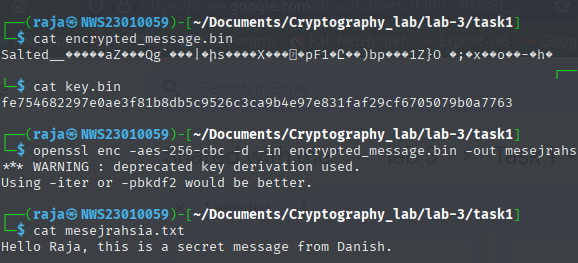
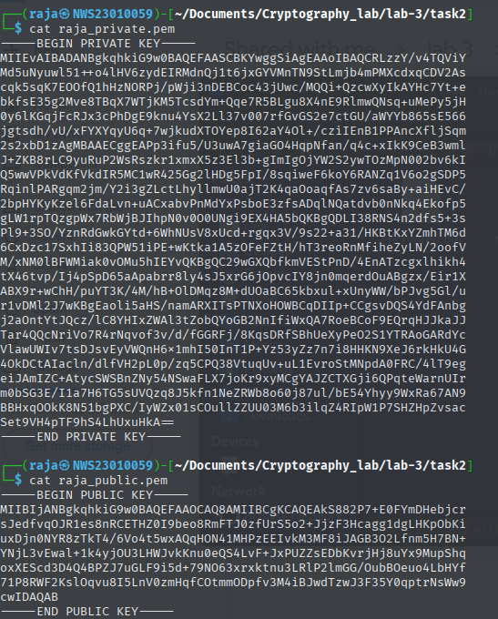
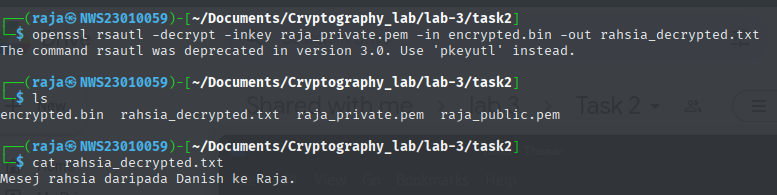
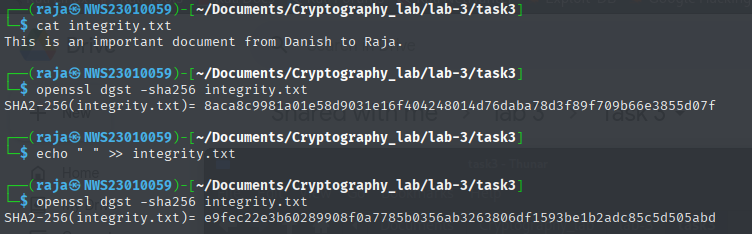
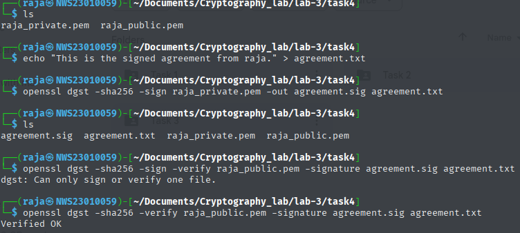

# Lab 3: Hands-on Exploration of Cryptographic Tools: Hashing, Encryption, and Digital Signatures

## 👨‍💻 Author: Raja Muhammad Haiqal Shah  
**Date:** April 20, 2025  
**Lab Instructor:** Adli Jaafar

---

## 🔍 Overview

This lab introduces OpenSSL and related tools for fundamental cryptographic operations:  
- Symmetric Encryption (AES-256-CBC)  
- Asymmetric Encryption (RSA)  
- Hashing (SHA-256)  
- Digital Signatures (RSA + SHA-256)  

---

## 🔧 Task 1: Symmetric Encryption and Decryption using AES-256-CBC

### Tools Used
- `OpenSSL`
- `Kali Linux`
- `Google Drive`

### Commands Executed

Danish generate a strong random key
```bash
openssl rand -hex 32 > key.bin
```
Danish create a plaintext message
```bash
echo "Hello, this is a secret message from Danish." > message.txt
```
Danish encrypt using AES-256-CBC
```bash
openssl enc -aes-256-cbc -salt -in message.txt -out encrypted_message.bin -pass file:./key.bin
```
> - `enc` : Encryption utility

> - `aes-256-cbc` : Specifies AES with 256-bit key in CBC mode

> - `salt` : Adds salt to prevent dictionary attacks

> - `pass file` : ./key.bin: Reads key from file


See how Danish encrypt [here]([https://github.com/Ha1qal/Raja-Haiqal/blob/master/Cryptography-Class/Assessments/Lab%20Works/Lab%203/screenshots/rsadecrypt.png](https://github.com/nishsem/Danish/tree/main/Cryptography-Class/Assessments/2-Lab-Works-20%25/Lab-Work-3#task-1-symmetric-encryption-and-decryption-using-aes-256-cbc)).

Then i retrieve the files using google drive and try to decode with the key given by Danish.
```bash
❯ ls
encrypted_message.bin  key.bin

❯ cat encrypted_message.bin
Salted__�����aZ���Qg`���|�իs��X���׎�pF1�Ը��)bp��1Z}O �;�x��o��-�h�%                                   

❯ cat key.bin
fe754682297e0ae3f81b8db5c9526c3ca9b4e97e831faf29cf6705079b0a7763

❯ openssl enc -aes-256-cbc -d -in encrypted_message.bin -out mesejrahsia.txt -pass file:$PWD/key.bin
*** WARNING : deprecated key derivation used.
Using -iter or -pbkdf2 would be better.

❯ cat mesejrahsia.txt
Hello Raja, this is a secret message from Danish.
```
<details>
<summary>Screenshot</summary>
<br>


</details>

### Analysis of Results
This demonstrates successful symmetric encryption and decryption using AES-256-CBC with a key.

---

## 🔐 Task 2: Asymmetric Encryption and Decryption using RSA

### Tools Used
- `OpenSSL`

### Commands Executed

```bash
openssl genpkey -algorithm RSA -out raja_private.pem -pkeyopt rsa_keygen_bits:2048

openssl rsa -pubout -in raja_private.pem -out raja_public.pem
```
<details>
<summary>Screenshot</summary>
<br>


</details>

Danish create secret message
```bash
echo "This is a private message for Danish from Raja." > rahsia.txt
```
Danish encrypt with my public key
```bash
openssl rsautl -encrypt -inkey danish_public.pem -pubin -in rahsia.txt -out encrypted.bin
```
See how danish encrypt with my public key [here](https://github.com/nishsem/Danish/tree/main/Cryptography-Class/Assessments/2-Lab-Works-20%25/Lab-Work-3#task-2-asymmetric-encryption-and-decryption-using-rsa)

i try to decrypt the key using my private key
```bash
openssl rsautl -decrypt -inkey raja_private.pem -in rahsia.enc -out rahsia_decrypted.txt
```
<details>
<summary>Screenshot</summary>
<br>

</details>

### Analysis of Results
Decrypted file matched original. RSA encryption using public key and decryption using private key ensures secure transmission. Minimum 2048-bit key ensures modern cryptographic strength.

---

## 🧮 Task 3: Hashing and Message Integrity using SHA-256

### Tools Used
- `OpenSSL`
- `sha256sum` (for comparison)

### Commands Executed

Danish create a file:
```bash
echo "This is an important document from Danish to Raja." > integrity.txt
```
Danish hash it
```bash
openssl dgst -sha256 integrity.txt
```
Output:
> SHA2-256(integrity.txt)= `8aca8c9981a01e58d9031e16f404248014d76daba78d3f89f709b66e3855d07f`

I try to verify the file and then edit the file.Afterwards i try to verify the file again to see if the file have the same hash.
```bash
❯ cat integrity.txt
This is an important document from Danish to Raja.

❯ openssl dgst -sha256 integrity.txt
SHA2-256(integrity.txt)= 8aca8c9981a01e58d9031e16f404248014d76daba78d3f89f709b66e3855d07f

❯ echo " " >> integrity.txt

❯ openssl dgst -sha256 integrity.txt
SHA2-256(integrity.txt)= e16f1596201850fd4a63680b27f603cb64e67176159be3d8ed78a4403fdb1700
```
<details>
<summary>Screenshot</summary>
<br>


</details>

Danish hash the original file with the modified file by Raja
```bash
openssl dgst -sha256 integrity.txt integrity1.txt
```
Output:
> SHA2-256(integrity.txt)= `8aca8c9981a01e58d9031e16f404248014d76daba78d3f89f709b66e3855d07f`

> SHA2-256(integrity1.txt)= `e9fec22e3b60289908f0a7785b0356ab3263806df1593be1b2adc85c5d505abd`

See how Danish done it and his Screenshots [here](https://github.com/nishsem/Danish/tree/main/Cryptography-Class/Assessments/2-Lab-Works-20%25/Lab-Work-3#task-3-hashing-and-message-integrity-using-sha-256)

### Analysis of Results
Even a minor change produced a completely different hash. This demonstrates hash functions' sensitivity to input and supports integrity verification.

---

## ✍️ Task 4: Digital Signatures using RSA

### Tools Used
- `OpenSSL`

### Commands Executed
I created the document and assign private and signature file.
```bash
# Step 1: Create document
echo "This is the signed agreement." > agreement.txt

# Step 2: Sign with RSA private key (SHA-256)
openssl dgst -sha256 -sign raja_private.pem -out agreement.sig agreement.txt

> `dgst` : -sha256: Hashing before signing

> `sign` : Signs using the private key

> `agreement.sig` : Signature output

# Step 3: Verify signature with public key
openssl dgst -sha256 -verify raja_public.pem -signature agreement.sig agreement.txt
```
<details>
<summary>Screenshot</summary>
<br>


</details>
Raja share the agreement and signature with Danish and Danish verifies using Raja’s public key

```bash
openssl dgst -sha256 -verify raja_public.pem -signature agreement.sig agreement.txt
```

Output:
```mathematica
Verified OK
```

---

1. Danish modify the agreement and he verify again
```bash
echo " Altered." >> agreement.txt
```
```bash
openssl dgst -sha256 -verify raja_public.pem -signature agreement.sig agreement.txt
```
Output:
```mathematica
Verification Failure
```

See Danish screenshots [here](https://github.com/nishsem/Danish/tree/main/Cryptography-Class/Assessments/2-Lab-Works-20%25/Lab-Work-3#task-4-digital-signatures-using-rsa)


### Analysis of Results
Signature verification failed after modifying the file, proving that digital signatures preserve both authenticity and integrity.

---

## 🛠️ Problems Encountered and Solutions

| Problem | Solution |
|--------|----------|
| Misused key file path | Used `-pass file:./aes.key` to fix |
| RSA encryption failed | Used `rsautl` with `-pubin` option |
| Signature verification failed unexpectedly | Double-checked file and signature pair, fixed by using correct unmodified file |

**Resources Used:** `man openssl`, OpenSSL documentation, Stack Overflow

---

## ✅ Conclusion

This lab successfully demonstrated key cryptographic operations using OpenSSL. It showed how encryption ensures confidentiality, hashing ensures integrity, and digital signatures ensure both authenticity and integrity. Each command taught valuable insights into cryptographic practices.

