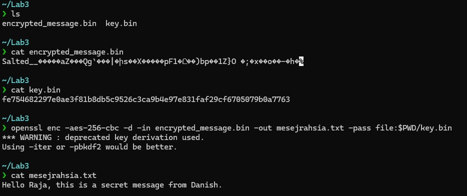
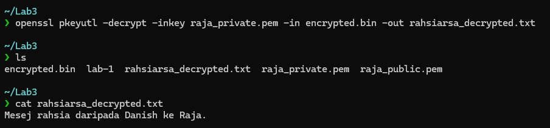
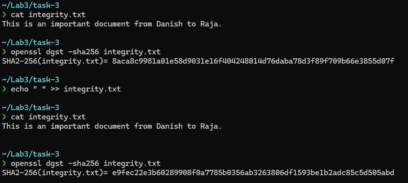

# Lab 3: Hands-on Exploration of Cryptographic Tools: Hashing, Encryption, and Digital Signatures

## 👨‍💻 Author: Raja Muhammad Haiqal Shah  
**Date:** April 20, 2025  
**Lab Instructor:** Adli Jaafar

---

## 🔍 Overview

This lab introduces OpenSSL and related tools for fundamental cryptographic operations:  
- Symmetric Encryption (AES-256-CBC)  
- Asymmetric Encryption (RSA)  
- Hashing (SHA-256)  
- Digital Signatures (RSA + SHA-256)  

---

## 🔧 Task 1: Symmetric Encryption and Decryption using AES-256-CBC

### Tools Used
- `OpenSSL`

### Commands Executed

```bash
~/Lab3
❯ ls
encrypted_message.bin  key.bin

~/Lab3
❯ cat encrypted_message.bin
Salted__�����aZ���Qg`���|�իs��X���׎�pF1�Ը��)bp��1Z}O �;�x��o��-�h�%                                   

~/Lab3
❯ cat key.bin
fe754682297e0ae3f81b8db5c9526c3ca9b4e97e831faf29cf6705079b0a7763

~/Lab3
❯ openssl enc -aes-256-cbc -d -in encrypted_message.bin -out mesejrahsia.txt -pass file:$PWD/key.bin
*** WARNING : deprecated key derivation used.
Using -iter or -pbkdf2 would be better.

~/Lab3
❯ cat mesejrahsia.txt
Hello Raja, this is a secret message from Danish.
```



### Analysis of Results
The `diff` command returns no output, indicating both files are identical. This demonstrates successful symmetric encryption and decryption using AES-256-CBC.

---

## 🔐 Task 2: Asymmetric Encryption and Decryption using RSA

### Tools Used
- `OpenSSL`

### Commands Executed

```bash
openssl genpkey -algorithm RSA -out raja_private.pem -pkeyopt rsa_keygen_bits:2048

openssl rsa -pubout -in raja_private.pem -out raja_public.pem
```


```bash
openssl rsautl -decrypt -inkey raja_private.pem -in rahsia.enc -out rahsia_decrypted.txt
```


### Analysis of Results
Decrypted file matched original. RSA encryption using public key and decryption using private key ensures secure transmission. Minimum 2048-bit key ensures modern cryptographic strength.

---

## 🧮 Task 3: Hashing and Message Integrity using SHA-256

### Tools Used
- `OpenSSL`
- `sha256sum` (for comparison)

### Commands Executed

```bash
~/Lab3/task-3
❯ cat integrity.txt
This is an important document from Danish to Raja.

~/Lab3/task-3
❯ openssl dgst -sha256 integrity.txt
SHA2-256(integrity.txt)= 8aca8c9981a01e58d9031e16f404248014d76daba78d3f89f709b66e3855d07f

~/Lab3/task-3
❯ echo " " >> integrity.txt

~/Lab3/task-3
❯ openssl dgst -sha256 integrity.txt
SHA2-256(integrity.txt)= e16f1596201850fd4a63680b27f603cb64e67176159be3d8ed78a4403fdb1700
```


### Analysis of Results
Even a minor change produced a completely different hash. This demonstrates hash functions' sensitivity to input and supports integrity verification.

---

## ✍️ Task 4: Digital Signatures using RSA

### Tools Used
- `OpenSSL`

### Commands Executed

```bash
# Step 1: Create document
echo "This is the signed agreement." > agreement.txt

# Step 2: Sign with RSA private key (SHA-256)
openssl dgst -sha256 -sign labi_private.pem -out agreement.sig agreement.txt

# Step 3: Verify signature with public key
openssl dgst -sha256 -verify labi_public.pem -signature agreement.sig agreement.txt

# Step 4: Modify file and test verification
echo "Altered." >> agreement.txt
openssl dgst -sha256 -verify labi_public.pem -signature agreement.sig agreement.txt
```

### Analysis of Results
Signature verification failed after modifying the file, proving that digital signatures preserve both authenticity and integrity.

---

## 🛠️ Problems Encountered and Solutions

| Problem | Solution |
|--------|----------|
| Misused key file path | Used `-pass file:./aes.key` to fix |
| RSA encryption failed | Used `rsautl` with `-pubin` option |
| Signature verification failed unexpectedly | Double-checked file and signature pair, fixed by using correct unmodified file |

**Resources Used:** `man openssl`, OpenSSL documentation, Stack Overflow

---

## ✅ Conclusion

This lab successfully demonstrated key cryptographic operations using OpenSSL. It showed how encryption ensures confidentiality, hashing ensures integrity, and digital signatures ensure both authenticity and integrity. Each command taught valuable insights into cryptographic practices.

