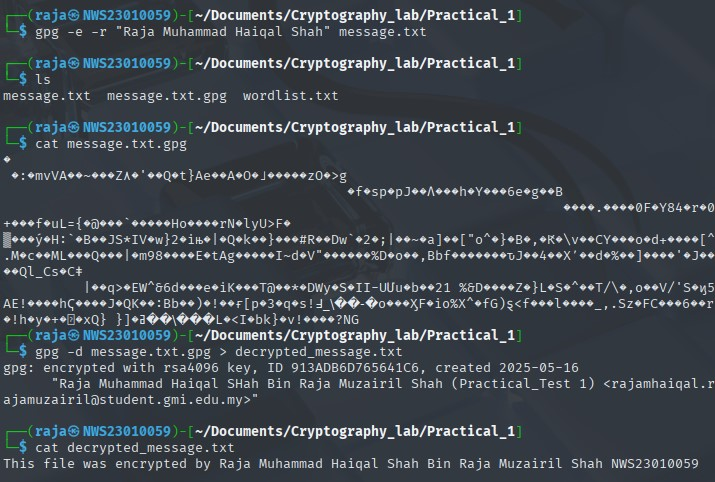

# Cryptography and Security Practical Tasks

## Task 1: Generate Your GPG Key Pair

**Objective:** Use `gpg` to generate an RSA key pair tied to your identity.

**Input:**
- Name: Raja Muhammad Haiqal Shah Bin Raja Muzairil Shah
- Email: rajamhaiqal.rajamuzairil@student.gmi.edu.my
- Key Type: RSA
- Key Size: 4096 bits
- Expiry: 1 year

**Commands:**

```bash
gpg --full-generate-key
# Follow prompts:  
# Select (1) RSA and RSA  
# Keysize 4096  
# Expiry 1y  
# Enter your name and email  
```
**Output:**


**Expected Output:**

- GPG key fingerprint shown after generation.
- Check keys with:

```bash
gpg --list-keys
```


---

## Task 2: Encrypt and Decrypt a File

**Objective:** Perform GPG encryption and decryption.

**Steps:**

1. Create a file `message.txt` containing:

```
This file was encrypted by Raja Muhammad Haiqal Shah NWS23010059
```

](screenshots/message-txt-content.jpg)

2. Encrypt the file using your public key:

```bash
gpg -e -r "Raja Muhammad Haiqal Shah" message.txt
```

3. Decrypt the file:

```bash
gpg --decrypt message.txt.gpg > decrypted_message.txt
```

4. Verify the content of `decrypted_message.txt`.


**Expected Output:**  
Decrypted file content matches the original message.



---

## Task 3: Sign and Verify a Message

**Objective:** Digitally sign a message and verify its authenticity.

**Steps:**

1. Create `signed_message.txt` containing:

```
I, Raja Muhammad Haiqal Shah, declare this is my work.
```

](screenshots/task3signedmessage.jpg)

2. Sign the message:

create a detached signature:

```bash
gpg --detach-sign signed_message.txt
```

3. Verify the signature:

```bash
gpg --verify signed_message.txt.sig signed_message.txt
```
detach-sign output:


---

## Task 4: Configure Passwordless SSH Authentication

**Objective:** Set up SSH key-based login.

**Steps:**

1. Generate SSH key pair with comment:

```bash
ssh-keygen -C "Raja Muhammad Haiqal Shah-NWS23010059"
```


2. Copy public key to server or localhost authorized keys:

```bash
scp $env:USERPROFILE\.ssh\id_rsa.pub raja@192.168.106.130:~/id_rsa.pub
```
copy key to my kali:


Then create folder for the key and give permission:


3. Test login without password:

```bash
ssh raja@192.168.106.130
```


4. SSH verification,View File Contents and Confirm Remote User

```bash
 ssh raja@192.168.106.130 "echo NWS23010059 > Raja_Muhammad_Haiqal_Shah.txt"

 ssh raja@192.168.106.130 "cat Raja_Muhammad_Haiqal_Shah.txt"

 ssh raja@192.168.106.130 whoami
```
**Expected Output:**


---

## Task 5: Hash Cracking Challenge

**Objective:** Crack provided hashes.

**Hashes:**

| Hash                                      | Type (Expected) |  
|-------------------------------------------|-----------------|  
| SnZlcmV4IEF2IEpmcmNyZSBFeiBCcnJl          | Base64 (likely) |  
| 6283293831c84671546324c9373704ca           | MD5             |  
| 2bc92f33a2ede5ada3d65b468a81f617d0229d843d87c63313833e509e5a6782 | SHA-256        |

**Expected Output:**

- Plaintext password for each hash.
- Tools, wordlists, or methods used (e.g., `john`, `hashcat`, base64 decode).

**Example commands:**
#### 1.First, I detected that the string SnZlcmV4IEF2IEpmcmNyZSBFeiBCcnJl was encoded in Base64, so I decoded it. However, the output was still gibberish. Based on the result, I suspected it was further encoded with a ROT cipher, but I wasn’t sure which ROT to use. So, I wrote a script to decode the Base64 and then enumerate through ROT-1 to ROT-25 to find the correct one.Other option is using tools online like dcode or cyberchef.

using cyberchef(magic mode):


it detected base64 but the output still gibberish so i try to decode again using dcode identifier and found it is ROT


but what rot it using?so i try to enumarate in cyberchef


so i found it need to be decrypt using ROT-9!
or just create a script

```python
import base64

# Your wordlist
wordlist = [
    "Bismillah",
    "Assalamualaikum Semua",
    "Apa Khabar Semuanya",
    "Semoga Dalam Keadaan Sihat Hendaknya",
    "Senang Je Soalan Ni Kaan",
    "Tapi Kalau Susah",
    "Begitulah Lumrah Kehidupan",
    "Ada Yang Senaang",
    "Ada Yang Susaaah",
    "Apa2 Pun",
    "Semoga Berjaya Semuanya",
    "Alhamdulillah",
    "Teruskan Usaha",
    "Jangan Mudah Putus Asa",
    "Setiap Cabaran Pasti Ada Hikmah",
    "Percaya Diri Sendiri",
    "Kejayaan Milik Yang Berusaha",
    "Semoga Hari Ini",
    "Lebih Baik Dari Semalam",
    "InsyaAllah"
]

def rot_n(text, shift):
    result = ""
    for char in text:
        if char.isalpha():
            if char.isupper():
                shifted = chr((ord(char) - ord('A') + shift) % 26 + ord('A'))
            else:
                shifted = chr((ord(char) - ord('a') + shift) % 26 + ord('a'))
            result += shifted
        else:
            result += char
    return result

def decode_and_search(encoded_text):
    # Step 1: Decode base64
    try:
        decoded = base64.b64decode(encoded_text).decode('utf-8')
        print(f"Base64 decoded: {decoded}\n")
    except Exception as e:
        print(f"Error decoding base64: {e}")
        return

    # Step 2: Try all ROT shifts and check against wordlist
    found_matches = False

    for shift in range(0, 26):
        rotated = rot_n(decoded, shift)

        # Check for exact matches in wordlist
        if rotated in wordlist:
            print(f"Found exact match with ROT-{shift}: '{rotated}'")
            found_matches = True

        # Check for partial matches (words contained in the rotated string)
        for word in wordlist:
            if word in rotated and word != rotated:
                print(f"Found partial match with ROT-{shift}: '{word}' in '{rotated}'")
                found_matches = True

    if not found_matches:
        print("No matches found in wordlist for any ROT shift")

# Your encoded string
encoded_string = "SnZlcmV4IEF2IEpmcmNyZSBFeiBCcnJl"

# Run the decoder and searcher
decode_and_search(encoded_string)
```

**Expected Output:**
```
Base64 decoded: Jverex Av Jfrcre Ez Brre

Found exact match with ROT-9: 'Senang Je Soalan Ni Kaan'
```


#### 2.7b77ca1e2b3e7228a82ecbc7ca0e6b52 i use hash-identifier it say that it is md5 so i create a script to brute-force it or i can use hashcat.

```bash
hashcat -m 0 -a 0 -o cracked.txt hash.txt wordlist.txt
```
this command will save the output in the cracked.txt file so we have to cat it.
```bash
 cat cracked.txt
7b77ca1e2b3e7228a82ecbc7ca0e6b52:Assalamualaikum Semua
```


#### 3.e583cee9ab9d7626c970fd6e9938fcb2d06fbbd12f1c1a3c6902a215808c825c using hash-identifier i got the result sha256.

so same command as number 2(md5) but i need to specify the mode to sha256 and save the 256 hash in hash2.txt.

```bash
hashcat -m 1400 -a 0 -o cracked.txt hash2.txt wordlist.txt
```

**Expected Output:**
```bash
cat cracked.txt
7b77ca1e2b3e7228a82ecbc7ca0e6b52:Assalamualaikum Semua
e583cee9ab9d7626c970fd6e9938fcb2d06fbbd12f1c1a3c6902a215808c825c:Begitulah Lumrah Kehidupan
```


| Hash                                      |     output      |  
|-------------------------------------------|-----------------|  
| SnZlcmV4IEF2IEpmcmNyZSBFeiBCcnJl          |  Senang Je Soalan Ni Kaan |  
| 7b77ca1e2b3e7228a82ecbc7ca0e6b52          |   Assalamualaikum Semua  |  
| e583cee9ab9d7626c970fd6e9938fcb2d06fbbd12f1c1a3c6902a215808c825c | Begitulah Lumrah Kehidupan       |

---

## Conclusion:
Throughout these tasks, I demonstrated core cryptographic operations including GPG key generation, encryption/decryption, digital signing, passwordless SSH configuration, and hash cracking using multiple tools and techniques. This assessment has enhanced my understanding of practical security implementations and attack surfaces.

