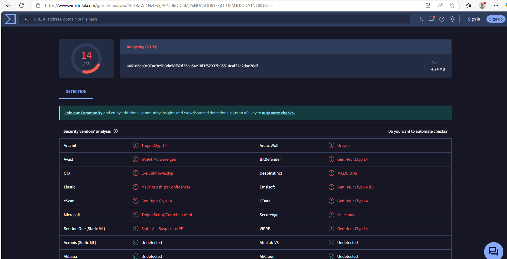
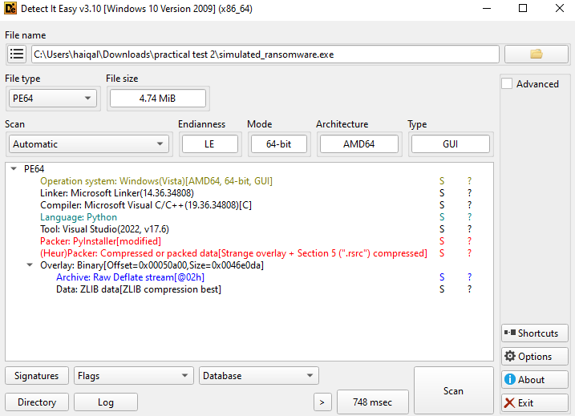
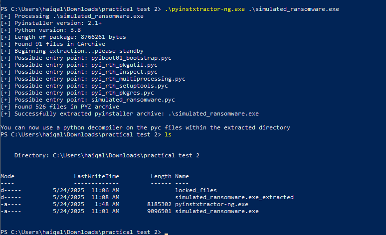
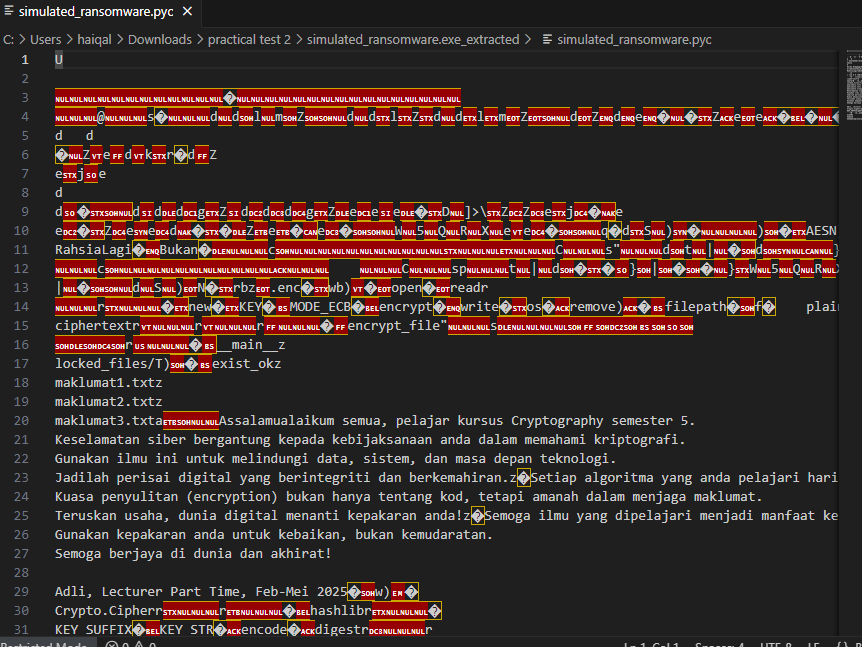
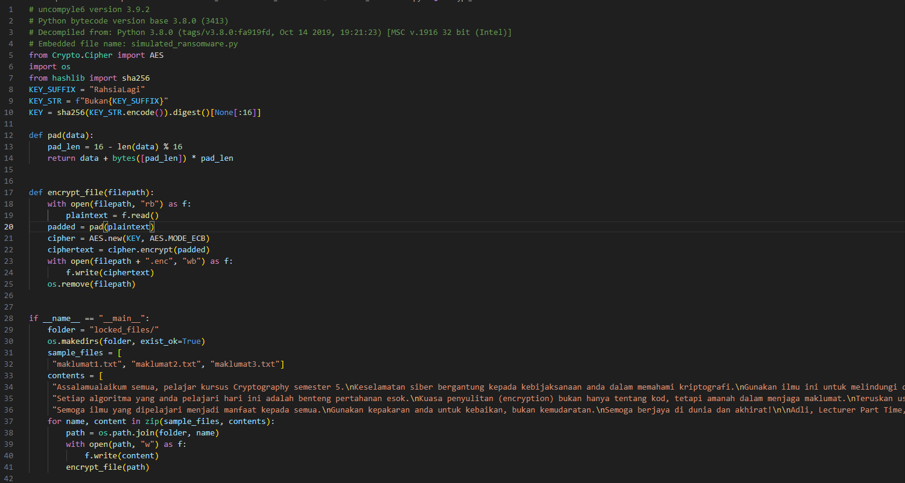

# 🔐 Ransomware Reverse Engineering Challenge – Practical Test 2

## 👨‍💻 Author
**Raja Muhammad Haiqal Shah**

---

## 🧩 Scenario Overview

This project simulates a **ransomware reverse engineering challenge**. The main objective is to reverse engineer a suspicious binary, identify the cryptographic mechanisms, and develop a Python decryption tool to recover encrypted .enc files.

⚠️ **Note**: This is a **simulated malware sample** for educational purposes. No real malware is involved.

---

## 🎯 Objectives

1. Perform **static reverse engineering** using DIE and pyinstxtractor.
2. Identify the **encryption algorithm**, key, and mode used.
3. Recover the original source code using **uncompyle6**.
4. Build a **Python decryption tool** (decrypt.py) to decrypt the victim's files.
5. Analyze and report **flaws in the cryptographic implementation**.

---

## 💻 Operating System & Tools Used

| Tool              | Purpose                                     |
|------------------|---------------------------------------------|
| Windows 10 Pro    | Operating System                            |
| DIE (Detect It Easy) | Detect packaging format (e.g., PyInstaller) |
| Python 3.8.0      | For running decryption script               |
| pyinstxtractor.py | Extract PyInstaller binary                  |
| uncompyle6        | Decompile .pyc files back to .py        |
| VSCode            | Code editing and script writing             |

---

## 🧪 Windows Setup and Usage Guide

## ✅ Step 1: Analyze malware file

#### I extract the hash file to confirm that this is the file that sir gave for practical test.


#### After I have extract the file,I got an .exe file so i was curious so I send to virustotal for analyze the file whether it is malware or not.Turns out it is(eeetakuttnyaaa).



#### so like a real malware analysis,i try to use DIE to analyze the file to detect what kind of language it used.Boom python language.



#### Then i curious what the malware do if we execute it,so i try to run it and it gave me 3 file .txt.enc.So my job right is to try to get to the source code and try to decode it by reverse engineering it.


## ✅ Step 2: Extract File And Set Up Python Environment
To decompile to python I need to use pyinsxtractor-ng(oh dont forget to download python and pyinsxtractor(github) in the machine).



#### After extract the file using pyinsxtractor,I list it in powershell to find suspicious file to see and i found simulated_ransomware.pyc the most interesting
```Powershell
 Directory: C:\Users\haiqal\Downloads\practical test 2\simulated_ransomware.exe_extracted
Mode                 LastWriteTime         Length Name
----                 -------------         ------ ----
d-----         5/24/2025  11:08 AM                Crypto
d-----         5/24/2025  11:08 AM                importlib_metadata-8.5.0.dist-info
d-----         5/24/2025  11:08 AM                PYZ.pyz_extracted
d-----         5/24/2025  11:08 AM                setuptools
-a----         5/24/2025  11:08 AM         841697 base_library.zip
-a----         5/24/2025  11:08 AM        3381792 libcrypto-1_1.dll
-a----         5/24/2025  11:08 AM          32792 libffi-7.dll
-a----         5/24/2025  11:08 AM         686112 libssl-1_1.dll
-a----         5/24/2025  11:08 AM         189512 pyexpat.pyd
-a----         5/24/2025  11:08 AM            875 pyiboot01_bootstrap.pyc
-a----         5/24/2025  11:08 AM           3015 pyimod01_archive.pyc
-a----         5/24/2025  11:08 AM          22889 pyimod02_importers.pyc
-a----         5/24/2025  11:08 AM           4019 pyimod03_ctypes.pyc
-a----         5/24/2025  11:08 AM           1100 pyimod04_pywin32.pyc
-a----         5/24/2025  11:08 AM           1584 pyi_rth_inspect.pyc
-a----         5/24/2025  11:08 AM           1122 pyi_rth_multiprocessing.pyc
-a----         5/24/2025  11:08 AM           4425 pyi_rth_pkgres.pyc
-a----         5/24/2025  11:08 AM            966 pyi_rth_pkgutil.pyc
-a----         5/24/2025  11:08 AM            779 pyi_rth_setuptools.pyc
-a----         5/24/2025  11:08 AM        4183112 python38.dll
-a----         5/24/2025  11:08 AM        2960275 PYZ.pyz
-a----         5/24/2025  11:08 AM          26696 select.pyd
-a----         5/24/2025  11:08 AM           1867 simulated_ransomware.pyc
-a----         5/24/2025  11:08 AM            311 struct.pyc
-a----         5/24/2025  11:08 AM        1096264 unicodedata.pyd
-a----         5/24/2025  11:08 AM          89752 VCRUNTIME140.dll
-a----         5/24/2025  11:08 AM          63560 _asyncio.pyd
-a----         5/24/2025  11:08 AM          84040 _bz2.pyd
-a----         5/24/2025  11:08 AM         177664 _cffi_backend.cp38-win_amd64.pyd
-a----         5/24/2025  11:08 AM         123464 _ctypes.pyd
-a----         5/24/2025  11:08 AM         267336 _decimal.pyd
-a----         5/24/2025  11:08 AM          45640 _hashlib.pyd
-a----         5/24/2025  11:08 AM         252488 _lzma.pyd
-a----         5/24/2025  11:08 AM          29256 _multiprocessing.pyd
-a----         5/24/2025  11:08 AM          45128 _overlapped.pyd
-a----         5/24/2025  11:08 AM          28232 _queue.pyd
-a----         5/24/2025  11:08 AM          78920 _socket.pyd
-a----         5/24/2025  11:08 AM         117832 _ssl.pyd
```

#### But when i try to open the file it cant be read by vscode.Then i realise I need to convert .pyc to .py to make it readable



#### So to convert it to .py i need to use uncompyle6 but i encountered an error


#### it says i need to run it in python environment that i have setup(silly me).Why i need to run it in evironment because the uncompyle6 support only python 3.8.0 but right now by default im running in python 3.13.0.That's why in short i have to use python environment for this particular path/folder.But i will show how to create python environment for future reference.
 
```powershell
 PS C:\Users\haiqal\Downloads\practical test 2> py -3.8-32 -m venv venv38
PS C:\Users\haiqal\Downloads\practical test 2> .\venv38\Scripts\Activate.ps1
.\venv38\Scripts\Activate.ps1 : File C:\Users\haiqal\Downloads\practical test 2\venv38\Scripts\Activate.ps1 cannot be
loaded because running scripts is disabled on this system. For more information, see about_Execution_Policies at
https:/go.microsoft.com/fwlink/?LinkID=135170.
At line:1 char:1
+ .\venv38\Scripts\Activate.ps1
+ ~~~~~~~~~~~~~~~~~~~~~~~~~~~~~
    + CategoryInfo          : SecurityError: (:) [], PSSecurityException
    + FullyQualifiedErrorId : UnauthorizedAccess
```

#### seems like i have error when try to activate it,so the trick to bypass this to write the command below and we are in the environment to install the uncompyle6.
```Powershell
Set-ExecutionPolicy -Scope CurrentUser -ExecutionPolicy RemoteSigned #This PowerShell cmdlet changes the execution policy, which controls what scripts are allowed to run in PowerShell.
.\venv38\Scripts\Activate.ps1
 pip install uncompyle6
```
the output kinda like this:


#### then I uncompyle it and open it in vscode.
```powershell
(venv38) PS C:\Users\haiqal\Downloads\practical test 2\simulated_ransomware.exe_extracted> uncompyle6 -o . .\simulated_ransomware.pyc
.\simulated_ransomware.pyc --
# Successfully decompiled file
```
## ✅ Step 3: Reverse Engineering the Source Code
#### Another note for me:
#### Please turn off Windows Defender completely.

#### When I opened the file, I found that the text was hardcoded. However, I want to try decrypting the .enc file it gave me. So, I attempted to reverse engineer the code to write a script that can decode three files which have been encoded with the .txt.enc extension.

#### (I can't paste the code here because Git detects it as malware.)



#### Based on the code what we know is:

-It uses AES encryption in ECB mode.
The encryption key is derived as:

```python
KEY_SUFFIX = "RahsiaLagi"
KEY_STR = f"Bukan{KEY_SUFFIX}"  # = "BukanRahsiaLagi"
KEY = sha256(KEY_STR.encode()).digest()[:16]  # 16-byte AES key
It uses PKCS-style padding.
```
It encrypts .txt files inside the locked_files/ folder and saves them as .enc files.

## ✅ Step 4: Create Decrypt Script
#### so to decode it i write a script to decript the current .enc file  to .txt readable file.( python -m pip install pycryptodome in order to run the script)
```python
from Crypto.Cipher import AES
from hashlib import sha256
import os

# Derive the same key as the ransomware
KEY_SUFFIX = "RahsiaLagi"
KEY_STR = f"Bukan{KEY_SUFFIX}"
KEY = sha256(KEY_STR.encode()).digest()[:16]

def unpad(data):
    pad_len = data[-1]
    return data[:-pad_len]

def decrypt_file(filepath):
    with open(filepath, "rb") as f:
        ciphertext = f.read()
    cipher = AES.new(KEY, AES.MODE_ECB)
    padded_plaintext = cipher.decrypt(ciphertext)
    plaintext = unpad(padded_plaintext)
    output_path = filepath.replace(".enc", "_decrypted.txt")
    with open(output_path, "wb") as f:
        f.write(plaintext)
    print(f"Decrypted: {filepath} -> {output_path}")

def main():
    folder = "."
    for file in os.listdir(folder):
        if file.endswith(".enc"):
            decrypt_file(os.path.join(folder, file))

if __name__ == "__main__":
    main()
```
#### the output:


#### alrightyy for the grand revealll


## ⚠️ Cryptographic Flaws Summary

The ransomware uses a flawed implementation of cryptography:
- [Example: Hardcoded static key]
- [Example: ECB mode – no IV or randomness]
- [Example: Key/IV exposed in plaintext or reversible logic]

### ✅ Secure Alternative Recommendations

- Use AES-GCM for authenticated encryption.
- Store keys securely using key derivation functions like PBKDF2 or scrypt.
- Never hardcode keys or IVs.


## 📘 References

- [PyCryptodome Docs](https://pycryptodome.readthedocs.io/en/latest/)
- [uncompyle6 GitHub](https://github.com/rocky/python-uncompyle6)
- [PyInstaller Extractor](https://github.com/extremecoders-re/pyinstxtractor)
- [DIE (Detect It Easy)](https://ntinfo.biz/index.html)

---

## 📄 Disclaimer

This is a **safe and simulated** ransomware binary created for educational use only. **Do not use or modify this project for malicious purposes.**

---