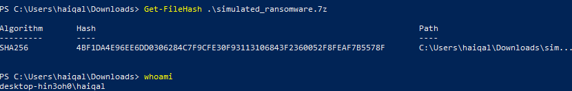
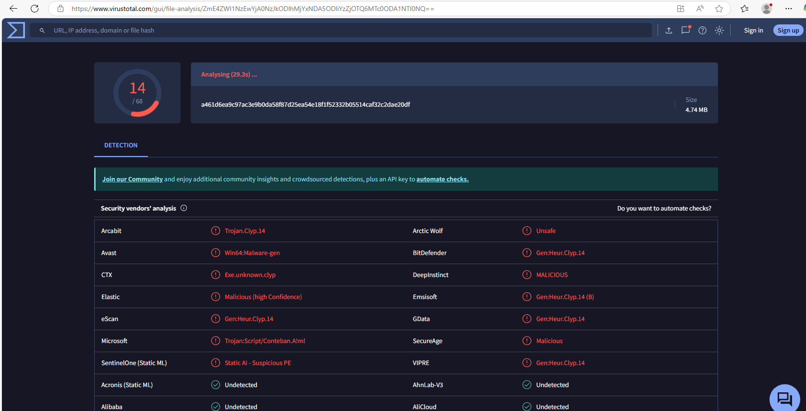
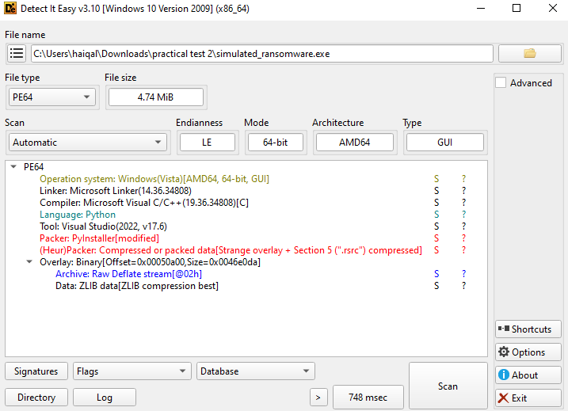
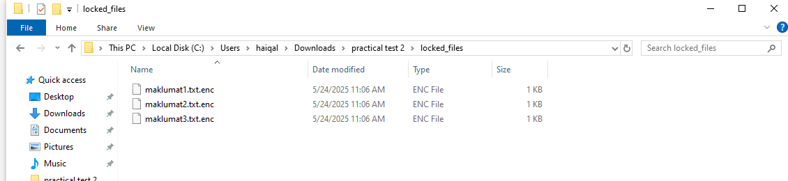
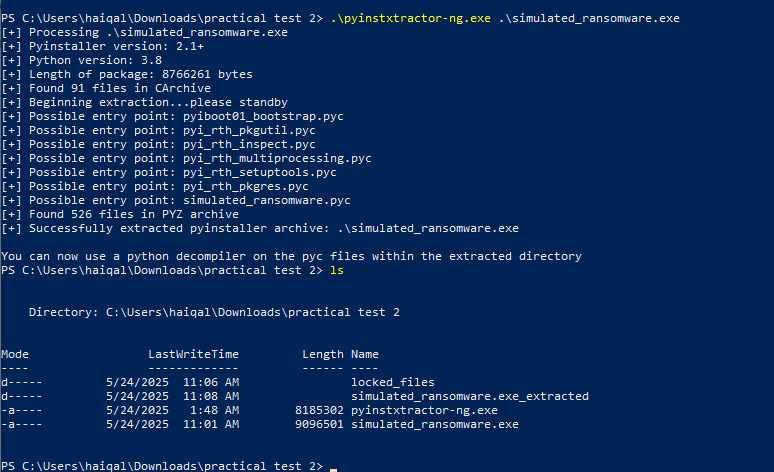
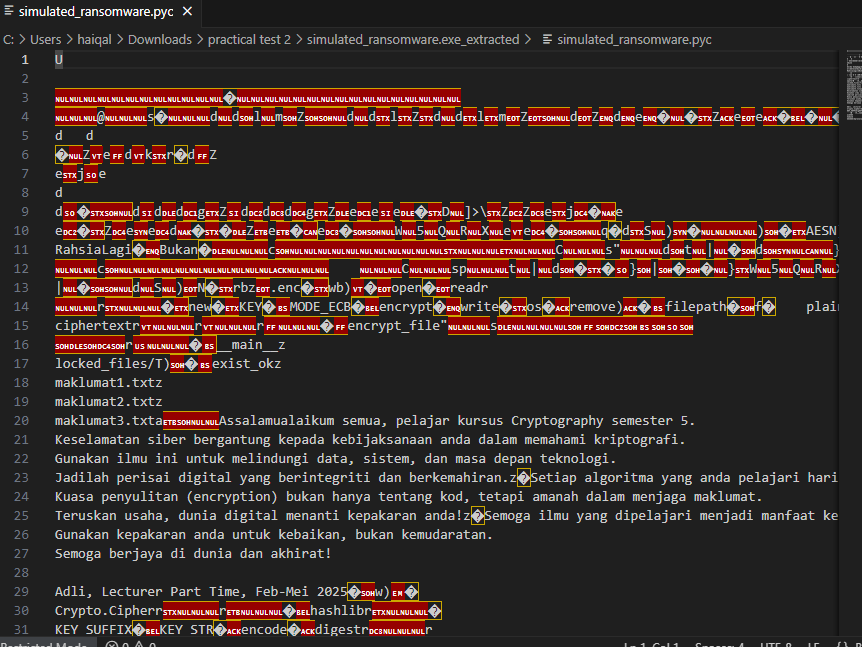

# 🔐 Ransomware Reverse Engineering Challenge – Practical Test 2

## 👨‍💻 Author
**Raja Muhammad Haiqal Shah**

---

## 🧩 Scenario Overview

This project simulates a **ransomware reverse engineering challenge**. The main objective is to reverse engineer a suspicious binary, identify the cryptographic mechanisms, and develop a Python decryption tool to recover encrypted `.enc` files.

⚠️ **Note**: This is a **simulated malware sample** for educational purposes. No real malware is involved.

---

## 🎯 Objectives

1. Perform **static reverse engineering** using DIE and pyinstxtractor.
2. Identify the **encryption algorithm**, key, and mode used.
3. Recover the original source code using **uncompyle6**.
4. Build a **Python decryption tool** (`decrypt.py`) to decrypt the victim's files.
5. Analyze and report **flaws in the cryptographic implementation**.

---

## 💻 Operating System & Tools Used

| Tool              | Purpose                                     |
|------------------|---------------------------------------------|
| Windows 10 Pro    | Operating System                            |
| DIE (Detect It Easy) | Detect packaging format (e.g., PyInstaller) |
| Python 3.8.0      | For running decryption script               |
| pyinstxtractor.py | Extract PyInstaller binary                  |
| uncompyle6        | Decompile `.pyc` files back to `.py`        |
| VSCode            | Code editing and script writing             |

---

## 🗂 Project Structure

| File / Folder       | Description                                                        |
|---------------------|--------------------------------------------------------------------|
| `analysis.md`        | Detailed static analysis and decryption methodology               |
| `decrypt.py`         | Python decryption tool using recovered key and algorithm          |
| `screenshots/`       | Evidence of decryption and reverse engineering process            |
| `decrypted/`         | Folder containing decrypted output files                          |
| `README.md`          | This file – project instructions and documentation                |

---

## 🧪 Windows Setup and Usage Guide

### ✅ Step 1: Extract File And Set Up Python Environment

I extract the hash file to confirm that this is the file that sir gave for practical test.




After I have extract the file,I got an .exe file so i was curious so I send to virustotal for analyze the file whether it is malware or not.Turns out it is(eeetakuttnyaaa).



so like a real malware analysis,i try to use DIE to analyze the file to detect what kind of language it use to compile.


Then i curious what the malware do if we execute it,so i try to run it and it gave me 3 file .txt.enc.So my job right is to try to get to the source code and try to decode it by reverse engineering it.




To decompile to python I need to use pyinsxtractor-ng(oh dont forget to download python in the machine)


After extract the file using pyinsxtractor,I list it in powershell to find suspicious file to see and i found simulated_ransomware.pyc the most interesting

 Directory: C:\Users\haiqal\Downloads\practical test 2\simulated_ransomware.exe_extracted

```Powershell
Mode                 LastWriteTime         Length Name
----                 -------------         ------ ----
d-----         5/24/2025  11:08 AM                Crypto
d-----         5/24/2025  11:08 AM                importlib_metadata-8.5.0.dist-info
d-----         5/24/2025  11:08 AM                PYZ.pyz_extracted
d-----         5/24/2025  11:08 AM                setuptools
-a----         5/24/2025  11:08 AM         841697 base_library.zip
-a----         5/24/2025  11:08 AM        3381792 libcrypto-1_1.dll
-a----         5/24/2025  11:08 AM          32792 libffi-7.dll
-a----         5/24/2025  11:08 AM         686112 libssl-1_1.dll
-a----         5/24/2025  11:08 AM         189512 pyexpat.pyd
-a----         5/24/2025  11:08 AM            875 pyiboot01_bootstrap.pyc
-a----         5/24/2025  11:08 AM           3015 pyimod01_archive.pyc
-a----         5/24/2025  11:08 AM          22889 pyimod02_importers.pyc
-a----         5/24/2025  11:08 AM           4019 pyimod03_ctypes.pyc
-a----         5/24/2025  11:08 AM           1100 pyimod04_pywin32.pyc
-a----         5/24/2025  11:08 AM           1584 pyi_rth_inspect.pyc
-a----         5/24/2025  11:08 AM           1122 pyi_rth_multiprocessing.pyc
-a----         5/24/2025  11:08 AM           4425 pyi_rth_pkgres.pyc
-a----         5/24/2025  11:08 AM            966 pyi_rth_pkgutil.pyc
-a----         5/24/2025  11:08 AM            779 pyi_rth_setuptools.pyc
-a----         5/24/2025  11:08 AM        4183112 python38.dll
-a----         5/24/2025  11:08 AM        2960275 PYZ.pyz
-a----         5/24/2025  11:08 AM          26696 select.pyd
-a----         5/24/2025  11:08 AM           1867 simulated_ransomware.pyc
-a----         5/24/2025  11:08 AM            311 struct.pyc
-a----         5/24/2025  11:08 AM        1096264 unicodedata.pyd
-a----         5/24/2025  11:08 AM          89752 VCRUNTIME140.dll
-a----         5/24/2025  11:08 AM          63560 _asyncio.pyd
-a----         5/24/2025  11:08 AM          84040 _bz2.pyd
-a----         5/24/2025  11:08 AM         177664 _cffi_backend.cp38-win_amd64.pyd
-a----         5/24/2025  11:08 AM         123464 _ctypes.pyd
-a----         5/24/2025  11:08 AM         267336 _decimal.pyd
-a----         5/24/2025  11:08 AM          45640 _hashlib.pyd
-a----         5/24/2025  11:08 AM         252488 _lzma.pyd
-a----         5/24/2025  11:08 AM          29256 _multiprocessing.pyd
-a----         5/24/2025  11:08 AM          45128 _overlapped.pyd
-a----         5/24/2025  11:08 AM          28232 _queue.pyd
-a----         5/24/2025  11:08 AM          78920 _socket.pyd
-a----         5/24/2025  11:08 AM         117832 _ssl.pyd
```

But when i try to open the file it cant be read by vscode.Then i realise I need to convert .pyc to .py to make it readable


So to convert it to .py i need to use uncompyle6 but i encountered an error


it says i need to run it in python environment that i have setup(silly me).Why i need to run it in evironment because the uncompye6 support only python 3.8.0 but right now by default im running in python 3.13.0.That's why in short i have to use python environment for this particular path/folder.But i will show hot to create python environment for future reference.
 ```powershell
 PS C:\Users\haiqal\Downloads\practical test 2> py -3.8-32 -m venv venv38
PS C:\Users\haiqal\Downloads\practical test 2> .\venv38\Scripts\Activate.ps1
.\venv38\Scripts\Activate.ps1 : File C:\Users\haiqal\Downloads\practical test 2\venv38\Scripts\Activate.ps1 cannot be
loaded because running scripts is disabled on this system. For more information, see about_Execution_Policies at
https:/go.microsoft.com/fwlink/?LinkID=135170.
At line:1 char:1
+ .\venv38\Scripts\Activate.ps1
+ ~~~~~~~~~~~~~~~~~~~~~~~~~~~~~
    + CategoryInfo          : SecurityError: (:) [], PSSecurityException
    + FullyQualifiedErrorId : UnauthorizedAccess
```
seems like i have error when try to activate it,so the trick to bypass this to write the command below and we are in the environment to install the uncomyle6.
```Powershell
Set-ExecutionPolicy -Scope CurrentUser -ExecutionPolicy RemoteSigned
.\venv38\Scripts\Activate.ps1
 pip install uncompyle6
```
the output kinda like this:


then I uncompyle it and open it in vscode.
```powershell
(venv38) PS C:\Users\haiqal\Downloads\practical test 2\simulated_ransomware.exe_extracted> uncompyle6 -o . .\simulated_ransomware.pyc
.\simulated_ransomware.pyc --
# Successfully decompiled file
```

Another note for me(Please turn off every defender).Then I open it and found it is hardcoded the text but i want to try to decrypt the file that it gave me in .enc so i try to reverse engineer this code to write a script to decode 3 files that have been encoded in .txt.enc.
```python
# uncompyle6 version 3.9.2
# Python bytecode version base 3.8.0 (3413)
# Decompiled from: Python 3.8.0 (tags/v3.8.0:fa919fd, Oct 14 2019, 19:21:23) [MSC v.1916 32 bit (Intel)]
# Embedded file name: simulated_ransomware.py
from Crypto.Cipher import AES
import os
from hashlib import sha256
KEY_SUFFIX = "RahsiaLagi"
KEY_STR = f"Bukan{KEY_SUFFIX}"
KEY = sha256(KEY_STR.encode()).digest()[None[:16]]

def pad(data):
    pad_len = 16 - len(data) % 16
    return data + bytes([pad_len]) * pad_len


def encrypt_file(filepath):
    with open(filepath, "rb") as f:
        plaintext = f.read()
    padded = pad(plaintext)
    cipher = AES.new(KEY, AES.MODE_ECB)
    ciphertext = cipher.encrypt(padded)
    with open(filepath + ".enc", "wb") as f:
        f.write(ciphertext)
    os.remove(filepath)


if __name__ == "__main__":
    folder = "locked_files/"
    os.makedirs(folder, exist_ok=True)
    sample_files = [
     "maklumat1.txt", "maklumat2.txt", "maklumat3.txt"]
    contents = [
     "Assalamualaikum semua, pelajar kursus Cryptography semester 5.\nKeselamatan siber bergantung kepada kebijaksanaan anda dalam memahami kriptografi.\nGunakan ilmu ini untuk melindungi data, sistem, dan masa depan teknologi.\nJadilah perisai digital yang berintegriti dan berkemahiran.",
     "Setiap algoritma yang anda pelajari hari ini adalah benteng pertahanan esok.\nKuasa penyulitan (encryption) bukan hanya tentang kod, tetapi amanah dalam menjaga maklumat.\nTeruskan usaha, dunia digital menanti kepakaran anda!",
     "Semoga ilmu yang dipelajari menjadi manfaat kepada semua.\nGunakan kepakaran anda untuk kebaikan, bukan kemudaratan.\nSemoga berjaya di dunia dan akhirat!\n\nAdli, Lecturer Part Time, Feb-Mei 2025"]
    for name, content in zip(sample_files, contents):
        path = os.path.join(folder, name)
        with open(path, "w") as f:
            f.write(content)
        encrypt_file(path)
```
Based on the code what we know is:

-It uses AES encryption in ECB mode.
The encryption key is derived as:

```python
KEY_SUFFIX = "RahsiaLagi"
KEY_STR = f"Bukan{KEY_SUFFIX}"  # = "BukanRahsiaLagi"
KEY = sha256(KEY_STR.encode()).digest()[:16]  # 16-byte AES key
It uses PKCS-style padding.
```
It encrypts .txt files inside the locked_files/ folder and saves them as .enc files.


so to decode it i write a script to decript the current .enc file  to .txt readable file
```python
from Crypto.Cipher import AES
from hashlib import sha256
import os

# Derive the same key as the ransomware
KEY_SUFFIX = "RahsiaLagi"
KEY_STR = f"Bukan{KEY_SUFFIX}"
KEY = sha256(KEY_STR.encode()).digest()[:16]

def unpad(data):
    pad_len = data[-1]
    return data[:-pad_len]

def decrypt_file(filepath):
    with open(filepath, "rb") as f:
        ciphertext = f.read()
    cipher = AES.new(KEY, AES.MODE_ECB)
    padded_plaintext = cipher.decrypt(ciphertext)
    plaintext = unpad(padded_plaintext)
    output_path = filepath.replace(".enc", "_decrypted.txt")
    with open(output_path, "wb") as f:
        f.write(plaintext)
    print(f"Decrypted: {filepath} -> {output_path}")

def main():
    folder = "."
    for file in os.listdir(folder):
        if file.endswith(".enc"):
            decrypt_file(os.path.join(folder, file))

if __name__ == "__main__":
    main()
```


1. Install Python 3.8.0 from [python.org](https://www.python.org/downloads/release/python-380/)
2. Add Python to your PATH environment variable.
3. Open Command Prompt (`cmd`) and install required libraries:
   ```bash
   pip install pycryptodome uncompyle6
   ```

---

### 🔍 Step 2: Static Analysis & Extraction

1. Use **DIE** to identify the binary packaging method (e.g., PyInstaller).
2. Extract contents using `pyinstxtractor.py`:
   ```bash
   python pyinstxtractor.py ransomware_sample.exe
   ```
   This creates a folder named `ransomware_sample.exe_extracted`.

3. Locate the `.pyc` files inside the `extracted` folder.

---

### 🔓 Step 3: Decompile `.pyc` to `.py`

Use **uncompyle6** to recover source code:
```bash
uncompyle6 extracted_file.pyc > recovered_source.py
```

Review `recovered_source.py` in **VSCode** to identify the:
- Algorithm (e.g., AES)
- Key, IV
- Encryption mode (e.g., CBC, ECB)
- Padding method (PKCS7, etc.)

---

### 🔐 Step 4: Run Decryption Script

After writing `decrypt.py`, run it using:

```bash
python decrypt.py
```

Make sure `.enc` files are in the same directory, and the decrypted output will be saved to the `decrypted/` folder.

---

## ⚠️ Cryptographic Flaws Summary

The ransomware uses a flawed implementation of cryptography:
- [Example: Hardcoded static key]
- [Example: ECB mode – no IV or randomness]
- [Example: Key/IV exposed in plaintext or reversible logic]

### ✅ Secure Alternative Recommendations

- Use `AES-GCM` for authenticated encryption.
- Store keys securely using key derivation functions like `PBKDF2` or `scrypt`.
- Never hardcode keys or IVs.

---

## 📸 Screenshots

See the `screenshots/` folder for:
- Binary analysis in DIE
- PyInstaller extraction
- Decompiled source code
- Decryption script output

---

## 📘 References

- [PyCryptodome Docs](https://pycryptodome.readthedocs.io/en/latest/)
- [uncompyle6 GitHub](https://github.com/rocky/python-uncompyle6)
- [PyInstaller Extractor](https://github.com/extremecoders-re/pyinstxtractor)
- [DIE (Detect It Easy)](https://ntinfo.biz/index.html)

---

## 📄 Disclaimer

This is a **safe and simulated** ransomware binary created for educational use only. **Do not use or modify this project for malicious purposes.**

---
